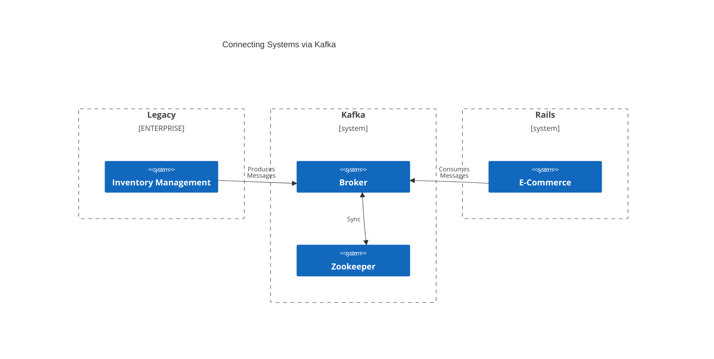

# README



A companion project for a [blog post](http://localhost:8000/blog/rails-kafka-consumer/) about integrating Kafka into a Rails project using the Karafka gem. Topics to be covered include:
* Have the consumer delegate to a service object to avoid mixing concerns of Kafka consumption with business logic.
* Have the service delegate to an ActiveModel for validations to avoid high branch complexity in the service.
* Error handling including Karafka's declarative DLQ (dead letter queue) and subscribing to error events, eg:
  ```ruby
  Karafka.monitor.subscribe 'error.occurred' do |event|
    # Or whatever error monitoring service Airbrake, Rollbar, etc.
    Sentry.capture_exception(event[:error])
  end
  ```

## Setup

Create and populate database:

```
bin/rails db:create
bin/rails db:reset
```

Start Kafka broker and Zookeeper:

```
docker-compose up
```

Start the Kafka consumer(s) polling for messages:

```
bundle exec karafka server
```

Produce message(s) from a Rails console `bundle exec rails c`:

```ruby
# Valid
Product.first.inventory
message = {
  product_code: Product.first.code,
  inventory_count: 25
}.to_json
Karafka.producer.produce_async(topic: 'inventory_management_product_updates', payload: message)
Product.first.inventory

# Invalid: Inventory count is negative
message = {
  product_code: Product.first.code,
  inventory_count: -1
}.to_json
Karafka.producer.produce_async(topic: 'inventory_management_product_updates', payload: message)

# Invalid: Product code does not exist
message = {
  product_code: "NO_SUCH_CODE",
  inventory_count: 5
}.to_json
Karafka.producer.produce_async(topic: 'inventory_management_product_updates', payload: message)

# Invalid: String instead of JSON
message = "this is no good"
Karafka.producer.produce_async(topic: 'inventory_management_product_updates', payload: message)

# Invalid: Unexpected attributes in JSON
message = { greeting: "hello" }.to_json
Karafka.producer.produce_async(topic: 'inventory_management_product_updates', payload: message)

# Take down database, then try to send a well structured message
```

## Run Automated Tests

```
bundle exec rspec
```
